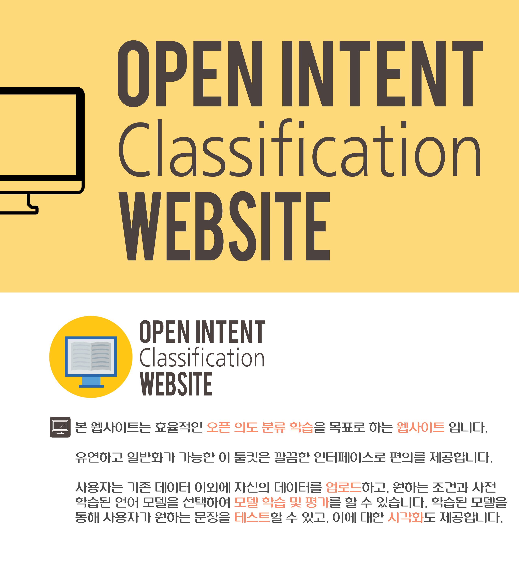
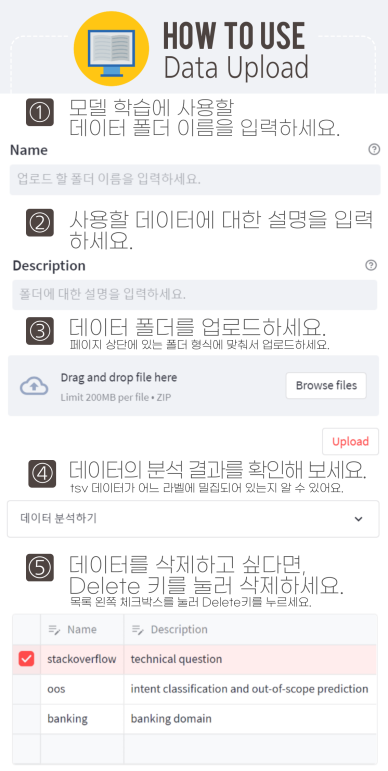
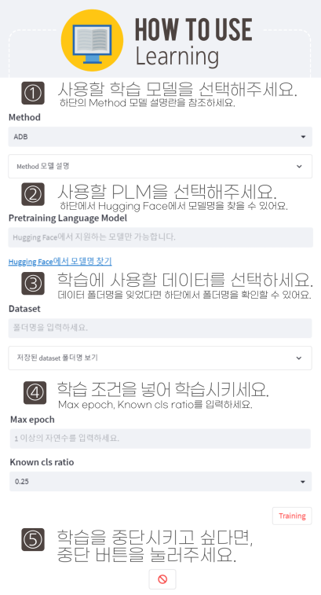
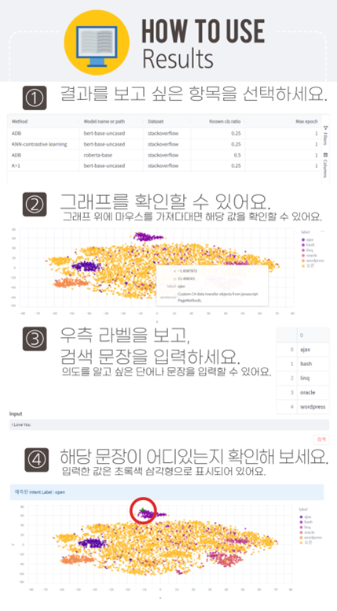

# withdain
# ToolKit
# 오픈 의도 분류 시스템 개발 및 분석

## 웹사이트 주소
http://210.117.181.115:8011


## 직접 실행을 원한다면

### 실행방법
```
uvicorn main:app --reload --host=0.0.0.0 --port=8010
streamlit run test.py - -server.port=8011
```

# 프로젝트 소개
+ 기존 open intent classification을 위한 toolkit을 보완
+ huggingface와 pytorch lightning을 통해 구현
<p align="center"></p>

## 사용 방법
### data upload
<p align="center"></p>

### learning page
<p align="center"></p>

### result_page
<p align="center"></p>


## 장점
+ 웹사이트로 접근 용이
+ 원하는 데이터를 추가&삭제 가능
<b>⇒ 원하는 데이터로 학습 가능
+ huggingface에서 지원하는 모든 PLM 모델 적용 가능
<b>⇒ 여러 언어로 학습 가능

